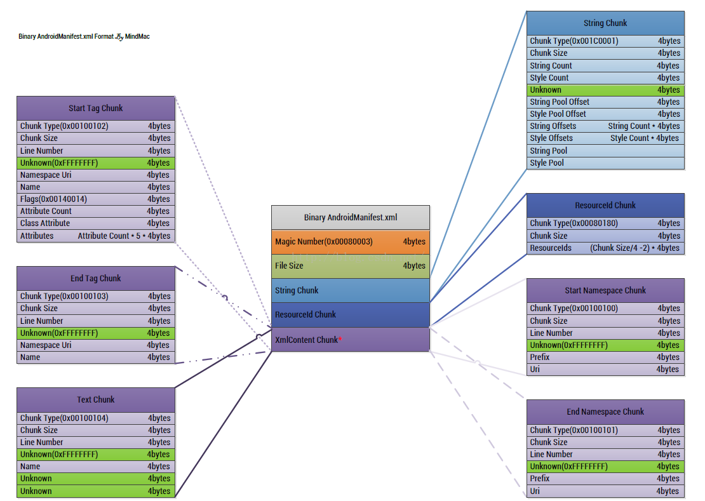

# AndroidManifest.xml二进制文件格式解析

图片来源于网络（侵删）

###1.magic:魔术
标识一个文件是类型,class、dex、xml、elf..... 
比如这里xml的magic就为0x100102

###2.FileSize:整个文件大小
用于校验文件是否完整以及一些其它用途

###3.StringChunk:全局字符串块
存储整个文件引用的字符串，减小文件体积和提高解析速度. 
相当于把所有字符串不存储到一个List\<String>,xml里面用到的字符串都直接引用这个list的一个position数据

未完善....